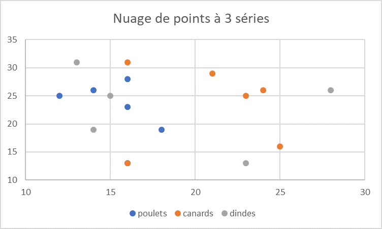

# Documentation afin de calculer le point moyen d'un nuage de points

---

*Suite au cours de **qualité de dévelopement**, j'ai réalisé la documentation permettant de calculer le **point moyen** d'un nuage de points vu en cours de Modélisation*  

---

### Sommaire

      1. Calcul de l'équation selon les points du nuage 
      2. Calcul du gradient afin de trouver les points critiques (coordonnées du point moyen)
      3. Vérification par le calcul de la Matrice Hessienne

### Contexte

La documentation suivante permet de déterminer **le point central** d'un nuage de points, grâce à leurs coordonnées dans un repère orthonormé.

### Introduction

Pour comprendre les calculs des points moyens nous allons utiliser un exemple d'application : 

Le nuage de point précédents représente l'age des galinacées`(x)` selon leur nombre`(y)`. Nous voulons déterminer le nombre et l'âge moyen selon chaque espèces que comporte la ferme.

Pour cela nous allons faire une liste des points présents sur le graphique selon chaque espèce :

poulet : 
$$(12;25), (14;26), (16;23), (16;27)$$

canard :
$$(16;13), (16;31)$$

dinde :
$$(13;31), (14;19), (15;25)$$

### I - Calcul de l'équation selon les points du nuage 

Pour chaque espèce :

En utilisant la formule permettant de calculer le point moyen entre deux points, on obtient :

$$f(x,y) = (x - \text{coordX})^{2} + (y - \text{coordY})^{2}$$

poulet : 
$$f(x,y) = (x - 12)^{2} + (y - 25)^{2} + (x - 14)^{2} + (y - 26)^{2} + (x - 16)^{2} + (y - 23)^{2} + (x - 16)^{2} + (y - 27)^{2}$$ 

canard : 
$$f(x,y) = (x - 16)^{2} + (y - 13)^{2} + (x - 16)^{2} + (y - 31)^{2}$$ 

dinde
$$f(x,y) = (x - 13)^{2} + (y - 31)^{2} + (x - 14)^{2} + (y - 19)^{2} + (x - 15)^{2} + (y - 25)^{2}$$ 

Il faut donc maintenant développer les équations : 

poulet :
$$4x^{2} - 116x + 4y^{2} - 202y + 3477$$ 

canard :
$$2x^{2} - 64x + 2 y^{2} - 88y + 1642$$ 

dinde :
$$3x^{2} -84x + 3y^{2} - 150y + 2537$$ 

### II - Calcul du gradient afin de trouver les points critiques (coordonnées du point moyen)

Pour chaque équation obtenue on calcule la dérivée par x et par y :

poulet :

$$f(x,y) = 4x^{2} - 116x + 4y^{2} - 202y + 3477$$ 

$$\displaystyle \frac{\partial f}{\partial x}(x,y) = 8x - 116$$ 

$$\displaystyle \frac{\partial f}{\partial y}(x,y) = 8y - 202$$

canard :

$$f(x,y) = 2x^{2} - 64x + 2 y^{2} - 88y + 1642$$

$$\displaystyle \frac{\partial f}{\partial x}(x,y) = 4x - 64$$

$$\displaystyle \frac{\partial f}{\partial y}(x,y) = 4y - 88$$

dinde :

$$f(x,y) = 3x^{2} -84x + 3y^{2} - 150y + 2537$$

$$\displaystyle \frac{\partial f}{\partial x}(x,y) = 6x - 84$$

$$\displaystyle \frac{\partial f}{\partial y}(x,y) = 6y - 150$$

On peut maintenant chercher les points moyens de chaque espèces, pour trouver le point x et le point y on prend la dérivée et on cherche quand x ou y = 0 :

poulet :

$$8x -116 = 0$$

$$8x = 116$$

$$\displaystyle \frac{8x}{8} = \displaystyle\frac{116}{8}$$

$$x = 14.5$$

$$8y - 202 = 0$$

$$8y = 202$$

$$\displaystyle \frac{8y}{8} = \displaystyle \frac{202}{8}$$

$$y = 25.25$$

Le point moyen des poulets est de coordonnées : $$(x = 14.5, y = 25.25)$$

canard :
$$4x - 64 = 0$$

$$4x = 64$$

$$\displaystyle\frac{4x}{4} = \displaystyle\frac{64}{4}$$

$$x = 16$$

$$4y - 88 = 0$$

$$4y = 88$$

$$\displaystyle\frac{4y}{4} = \displaystyle\frac{88}{4}$$

$$y = 22$$

Le point moyen des poulets est de coordonnées : $$(x = 16, y = 22)$$

dinde :
$$6x - 84 = 0$$

$$6x = 84$$

$$\displaystyle\frac{6x}{6} = \displaystyle\frac{84}{6}$$

$$x = 14$$

$$6y - 150 = 0$$

$$6y = 150$$

$$\displaystyle\frac{6y}{6} = \displaystyle\frac{150}{6}$$

$$y = 25$$

Le point moyen des poulets est de coordonnées : $$(x = 14, y = 25)$$

### III - Calcul du gradient afin de trouver les points critiques (coordonnées du point moyen)

Afin de vérifier que nous avons le point moyen minimal, il faut dérivée la dérivée de x et de y une nouvelle fois :

poulet :
$$\displaystyle \frac{\partial f}{\partial x}(x,y) = 8x - 116$$
$$\displaystyle \frac{\partial^2 f}{\partial x^2}(x,y) = 8$$

$$\displaystyle \frac{\partial f}{\partial y}(x,y) = 8y - 202$$
$$\displaystyle \frac{\partial^2 f}{\partial x^2}(x,y) = 8$$

$$\displaystyle \frac{\partial^2 f}{\partial x \partial y}(x,y) = 0$$

La matrice Hessienne est :

$$ 
\text{det}(M) = \begin{pmatrix} 8 & 0 \\ 0 & 8 \end{pmatrix} = 8 \times 8 - 0 \times 0 = 64 
$$

Le point est le point moyen minimum car f > 0 et M > 0

canard :
$$\displaystyle \frac{\partial f}{\partial x}(x,y) = 4x - 64$$
$$\displaystyle \frac{\partial ²f}{\partial x}(x,y) = 4$$

$$\displaystyle \frac{\partial f}{\partial y}(x,y) = 4y - 88$$
$$\displaystyle \frac{\partial ²f}{\partial y}(x,y) = 4$$

$$\displaystyle \frac{\partial^2 f}{\partial x \partial y}(x,y) = 0$$

La matrice Hessienne est : 
$$ 
\text{det}(M) = \begin{pmatrix} 4 & 0 \\ 0 & 4 \end{pmatrix} = 4 \times 4 - 0 \times 0 = 16 
$$

Le point est le point moyen minimum car f > 0 et M > 0

dinde :
$$\displaystyle \frac{\partial f}{\partial x}(x,y) = 6x - 84$$
$$\displaystyle \frac{\partial ²f}{\partial x}(x,y) = 6$$

$$\displaystyle \frac{\partial f}{\partial y}(x,y) = 6y - 150$$
$$\displaystyle \frac{\partial ²f}{\partial y}(x,y) = 6$$

$$\displaystyle \frac{\partial^2 f}{\partial x \partial y}(x,y) = 0$$

La matrice Hessienne est : 
$$ 
\text{det}(M) = \begin{pmatrix} 6 & 0 \\ 0 & 6 \end{pmatrix} = 6 \times 6 - 0 \times 0 = 36 
$$

Le point est le point moyen minimum car f > 0 et M > 0

  
### Pour aller plus loin

[Vidéo d'Yvan Monka](https://www.google.com/search?client=opera-gx&q=calcul+point+moyen+nuage&sourceid=opera&ie=UTF-8&oe=UTF-8#).